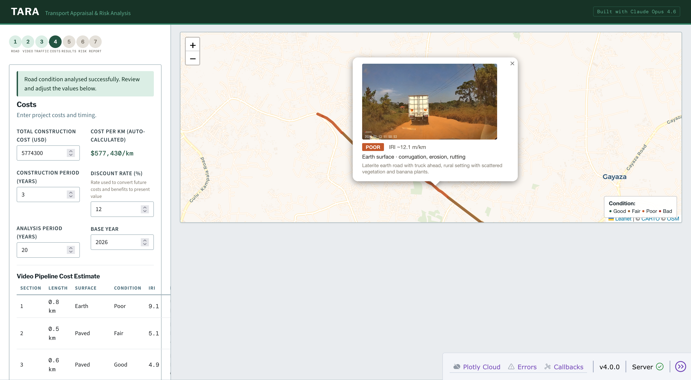
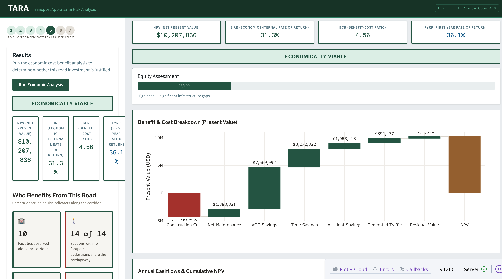
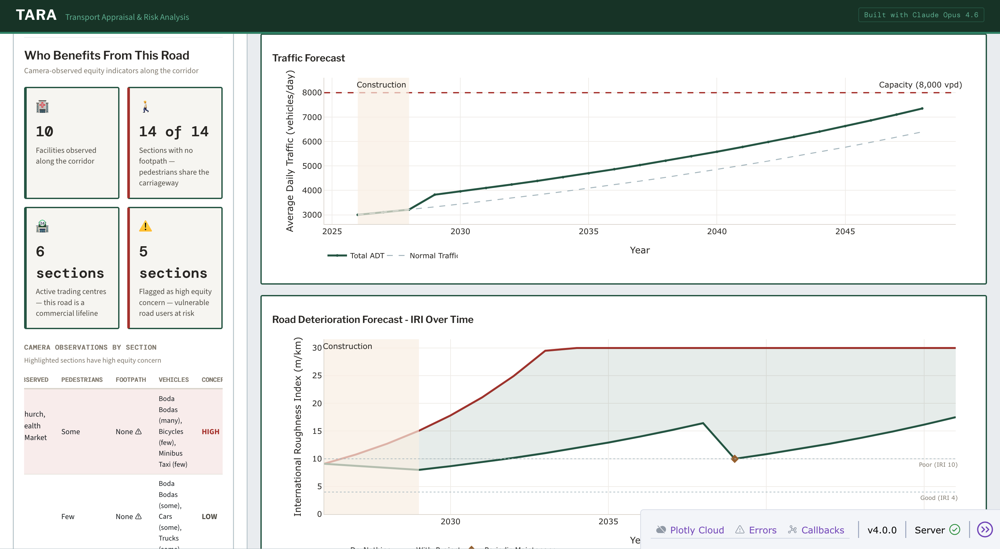
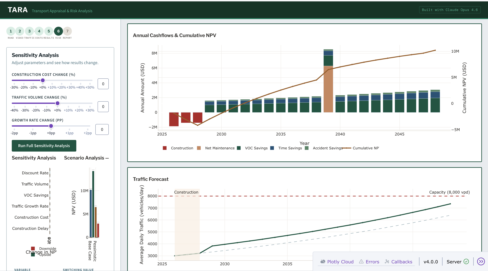

# TARA — Transport Appraisal & Risk Analysis

🏆 **Winner — "Keep Thinking" Prize, Anthropic Claude Code Hackathon 2026**

[](https://opensource.org/licenses/MIT)
[](https://www.anthropic.com)
[](https://python.org)
[](https://dash.plotly.com)

> From dashcam footage to investment decision — in hours, not weeks.

TARA is an AI-powered road appraisal tool that transforms dashcam footage into complete economic appraisals with equity assessment. A $56 dashcam doing the job of an $800,000 survey van.

## Demo

[](https://www.youtube.com/watch?v=GFCrXehS1DE)

*3-minute demo: dashcam footage → condition assessment → economic analysis → equity scoring → PDF report*

## Screenshots

| Condition Assessment | Economic Analysis |
|---|---|
|  |  |

| Equity Assessment | Sensitivity Analysis |
|---|---|
|  |  |

## What It Does

Upload dashcam footage and a GPS track from any road. TARA:

- 📹 Analyses every frame using Claude Opus 4.6 Vision (TMH12/ASTM D6433 standards)
- 🗺️ Segments the road into homogeneous sections by surface and condition
- 🔧 Selects appropriate interventions with Uganda-calibrated costs
- 📊 Runs full cost-benefit analysis (NPV, EIRR, BCR, FYRR)
- 🤖 Performs context-aware sensitivity analysis with AI interpretation
- 📉 Models road deterioration with and without intervention
- 👥 Assesses equity impact — who benefits from this road
- 📄 Generates a complete PDF report

## The Problem

Africa needs $181 billion annually in transport infrastructure. 80% of projects fail at feasibility — not because of money, but because project preparation takes weeks of specialist work most agencies can't afford. Road appraisal requires expensive software, trained specialists, and months of data gathering. TARA reduces this to hours using AI and a phone dashcam.

## How Claude Opus 4.6 Is Used

- **Vision API** — Frame-by-frame road condition assessment from dashcam footage
- **Condition narratives** — AI-written assessment grounded in what the camera observed
- **Sensitivity interpretation** — Context-aware analysis of which variables matter for this specific road
- **Equity assessment** — Identifying who depends on the road from camera observations
- **Report generation** — Professional narrative for each section of the appraisal
- **Built with Claude Code** — Multi-agent development with hooks for autonomous operation

## Quick Start

### Prerequisites
- Python 3.11+
- Anthropic API key (optional — cached demo data included)
- ffmpeg (for video processing): `brew install ffmpeg` (Mac) or `sudo apt install ffmpeg` (Ubuntu)

### Installation
```bash
git clone https://github.com/Kye256/tara-transport-assessment.git
cd tara-transport-assessment
pip install -r requirements.txt
```

### Run
```bash
export ANTHROPIC_API_KEY=your_key_here  # optional if using cached data
python app.py
```
Open http://localhost:8050

### Demo Data
Pre-cached assessment results are included. Select a dataset from the dropdown to explore the full workflow without an API key.

## Tech Stack

| Component | Technology |
|-----------|-----------|
| **Framework** | Dash (Python) |
| **AI** | Claude Opus 4.6 (Vision + Text) via Anthropic API |
| **Map** | dash-leaflet with CartoDB Positron tiles |
| **Data** | OpenStreetMap, UBOS Uganda census, WorldPop |
| **Analysis** | Custom CBA engine with 2024 UNRA HDM-4 calibration |
| **Charts** | Plotly |
| **Reports** | FPDF2 |

## Project Structure

```
tara-transport-assessment/
├── app.py                  # Main Dash application (7-step wizard + map)
├── agent/                  # Claude Opus 4.6 orchestrator
│   ├── orchestrator.py     # Agent loop with tool_use
│   ├── tools.py            # Tool definitions for the agent
│   └── prompts.py          # System prompts
├── skills/                 # Data gathering modules
│   ├── road_database.py    # Local road database (738 Uganda roads)
│   ├── osm_lookup.py       # OpenStreetMap road search
│   ├── osm_facilities.py   # Nearby facilities (health, education, markets)
│   ├── worldpop.py         # Population data from WorldPop
│   ├── kontur_population.py# Kontur population grid
│   └── dashcam.py          # Dashcam image analysis
├── engine/                 # Analysis modules
│   ├── cba.py              # Cost-benefit analysis (NPV, EIRR, BCR, FYRR)
│   ├── traffic.py          # Traffic forecasting (per-vehicle-class)
│   ├── sensitivity.py      # Sensitivity & scenario analysis
│   ├── equity.py           # Equity scoring
│   └── deterioration.py    # Road deterioration modelling
├── video/                  # Video processing pipeline
│   ├── video_pipeline.py   # End-to-end dashcam → condition pipeline
│   ├── video_frames.py     # Frame extraction from video clips
│   ├── vision_assess.py    # Claude Vision frame assessment
│   ├── gps_utils.py        # GPX parsing and geo-matching
│   ├── video_map.py        # Condition map generation
│   ├── intervention.py     # Per-section intervention recommendations
│   ├── equity.py           # Equity narrative from video observations
│   ├── datasets.py         # Dataset discovery and cache management
│   └── test_pipeline.py    # Pipeline validation (12 checks)
├── output/                 # Report & chart generation
│   ├── report.py           # PDF report generator
│   ├── charts.py           # Plotly charts (tornado, waterfall, etc.)
│   └── maps.py             # dash-leaflet map components
├── config/
│   └── parameters.py       # Uganda-calibrated default parameters
├── data/
│   ├── uganda_main_roads.geojson          # 738 named roads
│   ├── uganda_main_roads_enriched.geojson # Roads with population data
│   └── videos/*/cache/     # Cached assessment results (for demo)
├── assets/
│   ├── style.css           # Custom styles
│   └── typing.js           # Typing animation
├── scripts/                # Data preprocessing scripts
│   ├── build_road_database.py
│   └── enrich_road_database.py
└── docs/                   # Specifications and planning documents
```

## Author

**Kyeyune Kazibwe** — Transport Engineer, Kampala, Uganda

- Built solo in 6 days during the Anthropic Claude Code Hackathon (Feb 10-16, 2026)
- Winner of the "Keep Thinking" Prize

## License

MIT — see [LICENSE](LICENSE)
